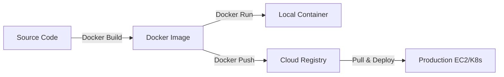
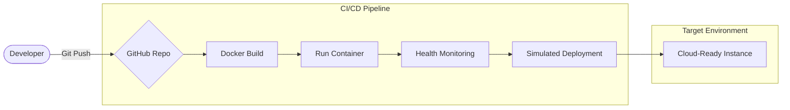
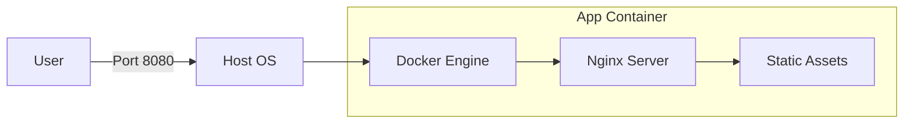

# Cloud-Ready Dockerized Application with CI/CD Automation 🚀

Developed by **Sachin C S** | DevOps & Containerization Specialist

---

## 📌 Project Overview

The **Cloud-Ready Dockerized Application** is a professional-grade DevOps showcase that demonstrates the power of containerization and automated software delivery.

By wrapping a modern web application into a lightweight Docker container, this project ensures "Run Anywhere" portability, while a robust 5-stage CI/CD pipeline handles the heavy lifting of building, testing, and simulating cloud deployment.

---

## 🏗️ Docker Architecture & Concept

### 📦 Containerization Philosophy

This project utilizes **Docker** to encapsulate the application and its environment into a single, immutable unit. By using `nginx:stable-alpine`, we achieve:

- **Zero-Dependency Hosting**: No need to install Nginx or Node.js on the host machine.
- **Micro-Footprint**: The resulting image is less than 20MB, optimized for high-speed cloud scaling.

### 🔄 Deployment Logic (Mermaid)



---

## 🏗️ Infrastructure Visualization

### 🛠️ High-Level Architecture



### 📈 Container Flow



---

## 🤖 CI/CD Pipeline Explanation

Our **GitHub Actions** workflow (`cicd.yml`) executes the following automated stages:

1.  **Checkout**: Pulls the latest source code.
2.  **Build Docker Image**: Executes `scripts/build.sh` to create a production-ready image.
3.  **Run Container**: Executes `scripts/run.sh` to start the application in a headless state.
4.  **Health Monitoring**: Executes `scripts/monitor.sh` to verify the container is healthy and responding.
5.  **Simulated Deployment**: Executes `scripts/deploy.sh` to model a real-world cloud push.

---

## 🚀 How to Run Locally

### Prerequisites

- [Docker](https://www.docker.com/products/docker-desktop/) installed.
- Bash-compatible terminal.

### Execution

```bash
# 1. Clone the repository
git clone https://github.com/01Sachinc/docker-devops-project.git
cd docker-devops-project

# 2. Grant execution permissions
chmod +x scripts/*.sh

# 3. Build & Run the system
./scripts/build.sh
./scripts/run.sh

# 4. Check Health
./scripts/monitor.sh
```

Access the application at [http://localhost:8080](http://localhost:8080).

---

## 📁 Project Structure

```text
docker-devops-project/
├── app/                    # Web Application Source
├── docker/                 # Dockerfile & Compose logic
├── scripts/                # Bash automation engine
├── .github/workflows/      # CI/CD Pipeline
└── architecture/           # Visual diagrams
```

---

---

## 📜 License

MIT License. Created by **Sachin C S** for Portfolio.
